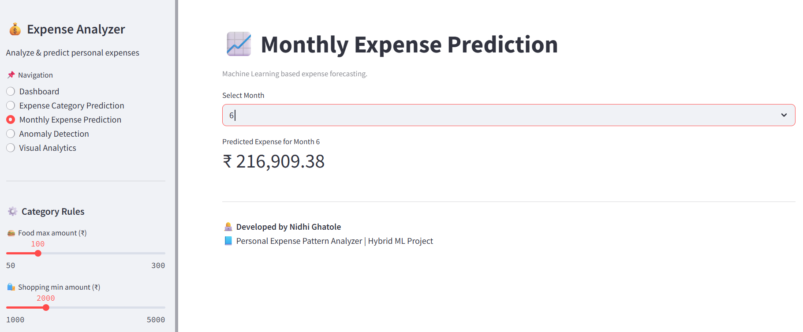

# 💰 Personal Expense Pattern Analyzer

A **Machine Learning–based Streamlit web application** that analyzes personal expense data by:
- Classifying transactions into categories  
- Predicting monthly spending using regression models  
- Detecting abnormal or suspicious transactions using anomaly detection techniques  

---

## 📌 Project Overview

Managing personal finances effectively requires a clear understanding of spending behavior.  
This project leverages **Machine Learning algorithms** to analyze personal expense data and provide meaningful insights through an **interactive Streamlit web interface**.

The system automates expense analysis by:
- Expense category classification  
- Monthly expense forecasting  
- Detection of unusual spending patterns  

This makes it useful for **personal finance management** as well as **academic and learning purposes**.

---

## 🚀 Features

- 🔍 Expense category classification using **Random Forest Classifier**
- 📈 Monthly expense prediction using **Regression Models**
- 🚨 Anomaly detection using **Isolation Forest**
- 📊 Interactive data visualizations
- 🌐 User-friendly **Streamlit web interface**

---

## 🛠️ Technologies Used

**Programming Language**
- Python

**Libraries**
- Pandas
- NumPy
- Scikit-learn
- Matplotlib
- Seaborn

**Web Framework**
- Streamlit

**Machine Learning Models**
- Random Forest Classifier  
- Random Forest Regressor  
- Isolation Forest  

---

## 📸 Application Screenshots

### 🧾 Input Screen 1 – Expense Dashboard


### 🧾 Input Screen 2 – Expense Category


### 📊 Output Screen 2 – Expense Category Prediction


### 🧾 Input Screen 3 – Monthly Expense


### 📈 Output Screen 3 – Monthly Expense Prediction


### 🧾 Input Screen 4 – Anomaly Detection Input


### 🧾 Input Screen 5 – Final Visual Analytics Summary


---

## 📂 Project Structure

```text
Personal-Expense-Pattern-Analyzer/
│
├── app.py                          # Streamlit web application
├── expense_data.csv                # Expense dataset
├── expense_classifier_model.pkl    # Trained classification model
├── monthly_expense_regressor.pkl   # Trained regression model
├── anomaly_detector.pkl            # Trained anomaly detection model
├── scaler.pkl                      # Feature scaling object
├── requirements.txt                # Project dependencies
├── README.md                       # Project documentation
│
└── images/                         # Application screenshots
    ├── input1.png
    ├── input2.png
    ├── output2.png
    ├── input3.png
    ├── output3.png
    ├── input4.png
    └── input5.png

---
```

## ⚙️ How to Run the Project

### 1️⃣ Install Required Dependencies
```bash
pip install -r requirements.txt
```

### 2️⃣ Run the Streamlit Application
```bash
streamlit run app.py
```

### 3️⃣ Open in Browser
```
http://localhost:8501
```

---

## 🎯 Use Cases

- Personal expense tracking and analysis  
- Budget planning and financial forecasting  
- Detection of unusual or suspicious transactions  
- Academic and learning projects in Machine Learning  

---

## 🔮 Future Enhancements

- Category name decoding for user-friendly predictions  
- User authentication and profile management  
- Real-time expense input and tracking  
- Database integration for persistent storage  
- Advanced dashboards and analytics  

---

## 👩‍💻 Author

**Nidhi Ghatole**  
Machine Learning & Data Science Enthusiast  

---

## 📜 License

This project is licensed for educational and learning purposes.  
